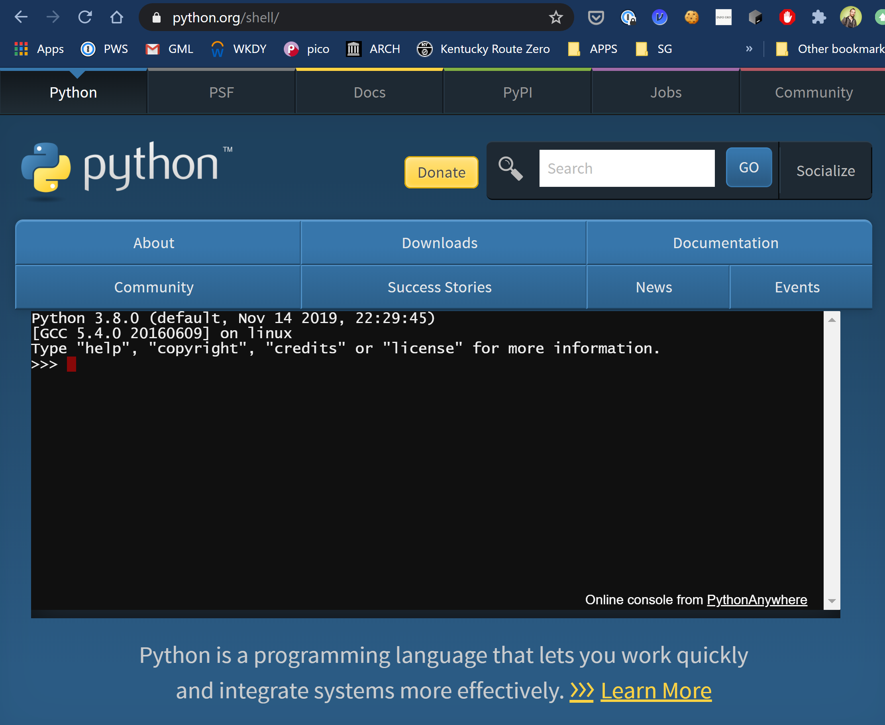

# The Backup Plan

## Reasoning

For anything (esp. technology related) it's good to have some foresight and 
realize that something(s) may not go according to plan. Some backup plans are
better than others, but actually having a backup plan in place is infinitely 
better than not having anything to fallback on!

## Clarification on Files in this Repository

There are 3 pieces of code in this repo:

1. mystery-code.py
2. demystified-code.py
3. important-code.py

These files are pretty normal Python scripts. For each of these scripts, there
is a "copypasta" version, which is valid, though abnormal Python code. The 
copypasta version is provided so that you can copy and paste code into a
different sort of terminal.

## Tutorial on python.org/shell

1. Copy all the contents of the "copypasta" version of code in this repo you
   want to interact with. Such as [mystery-code.copypasta.py](mystery-code.copypasta.py).
   
2. Navigate your browser to [python.org/shell](https://python.org/shell)

3. Paste the script into terminal prompt when it finishes loading and looks 
   like:
   

4. Your terminal prompt should read  `>>> exec(code)` if successful.
   Press enter.

5. For mystery-code, there are no prompts, but it asks for two inputs and 
   prints one of them.
   
6. This is good way to interact with any of our code that has a "copypasta" version.

NOTE: The Binder method of interacting with code gives you a minimal Linux 
Linux environment, while this method gives you a Python interpreter.
