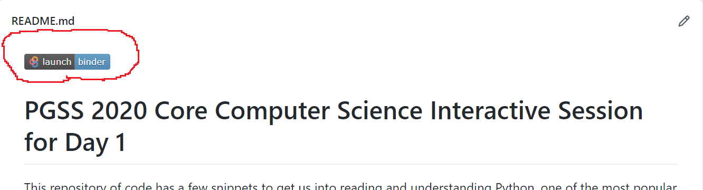
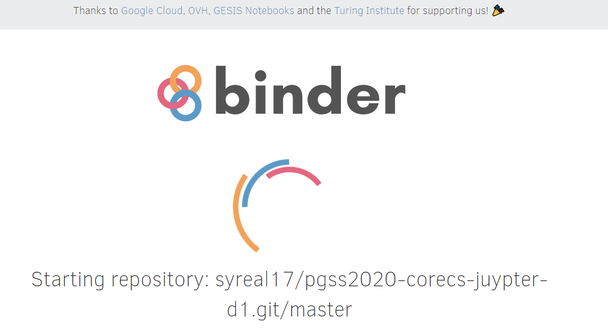
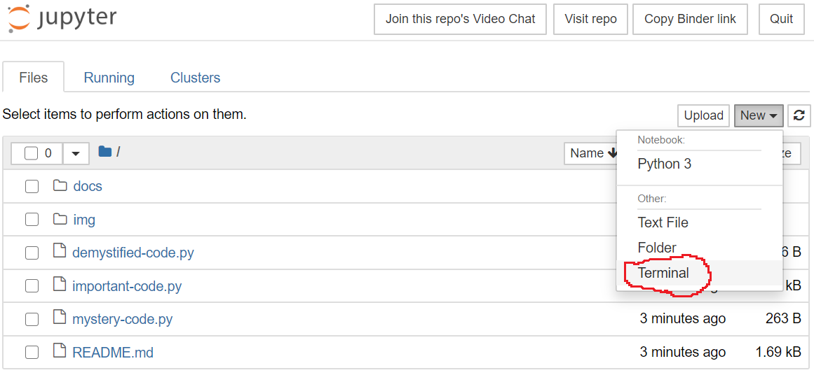
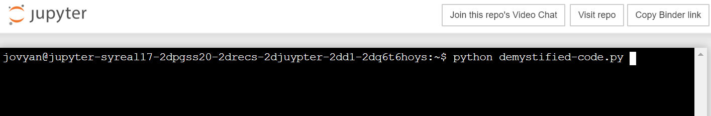
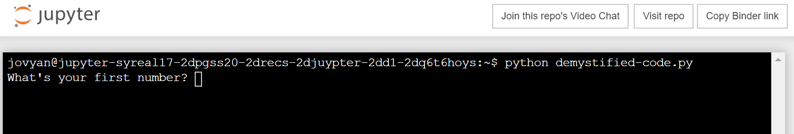

# PGSS 2020 Core Computer Science Interactive Session for Day 1
This repository of code has a few snippets to get us into reading and 
understanding Python, one of the most popular and well supported 
programming languages in the last decade.

# Tutorial on Interacting with this Code
## Notes on these Environments
### These Environments are Donations from Good People
Please note that the service I have elected to use for these demos
is open-source and free to use. Please respect these computing 
resources.

### These Environments are Ephemeral
The link at the top of this page will give you a very small Linux
machine to do some basic commands and Python work. To save anything
from these sessions, you will have to copy and paste it out of the
Juypter tab. The small Linux computer will cease to exist when you 
close the tab.

## Getting to your Shiny, New, Ephemeral Linux Environment

1. Click on the "Launch Binder" button at the top of this document

2. Wait a few minutes for your new Linux environment to start

This does take a few minutes, usually. A computer is being born (and 
waking up).

3. 

  1. Select "New" on the upper right side of the next screen.
  
  2. Select "Terminal" in that dropdown menu.

4. Type the following command into your new Terminal and press the Enter key:

`python demystified-code.py`

5. Let an instructor know if you are not prompted for a number after you press enter, like so:

That is the way to run scripts that can be interacted with!